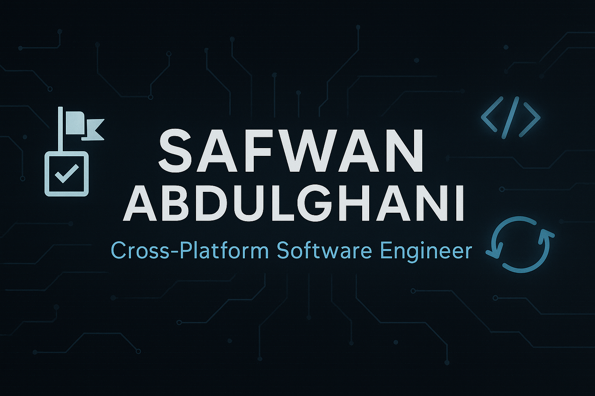

  

<h1 align="center">👋 Hey, I'm Safwan</h1>
<h3 align="center">Cross-Platform Software Engineer</h3>

  I build reliable, high-performance software across platforms from system-level tools to modern .NET and Kotlin apps. 
  I care about architecture, developer experience, and clean, scalable engineering.

---

### 🔥 Featured Projects

| Project | Description | Tech | Links |
|--------|-------------|------|------|
| **SharpResults** | Functional Result/Option types for .NET with zero-alloc focus | C# / .NET | [NuGet](https://www.nuget.org/packages/SharpResults) • [GitHub](https://github.com/safwa1/SharpResults) |
| **RoomSharp** | Source-generated ORM with SQL dialect awareness | C# / .NET | GitHub *(Coming Soon)* |
| **KResult** | Kotlin Multiplatform Result library with coroutine integration | Kotlin / KMP | [GitHub](https://github.com/SafwanAbdulghani/KResult) |
| **CRoutines** | Coroutine-style async job manager for .NET | C# / .NET | [NuGet](https://www.nuget.org/packages/CRoutines) • [GitHub](https://github.com/safwa1/CRoutines) |

---

### 🧱 Core Skills

- **Primary Stack:** C#, Kotlin, Rust, C++
- **Cross-Platform Development:** .NET, KMP, WinUI 3, Qt
- **System Engineering:** concurrency, memory, async runtimes
- **Libraries & Tooling:** NuGet package authoring, code generation, API design
- **Backend Engineering:** ASP.NET Core, REST APIs, data modeling

---

### 🔧 Additional Skills

- Languages: Swift, Go, PHP, Dart, TypeScript, Zig
- UI Frameworks: WPF, WinForms, MAUI, Blazor, React, Vue, SolidJS
- Databases & Data: SQL Server, MySQL, SQLite, Dapper, EF Core
- DevOps & Tools: GitHub Actions, Docker, CI/CD pipelines

---

### 📊 Developer Stats

  
  &nbsp;
  

---

### 🌍 Connect with Me

- Website: Coming soon (**safwan.pro**)
- Email: [support@safwan.pro](mailto:support@safwan.pro)
- WhatsApp: [Chat](https://wa.me/967715058661)

---

  <b>Building tools that empower developers.</b>

